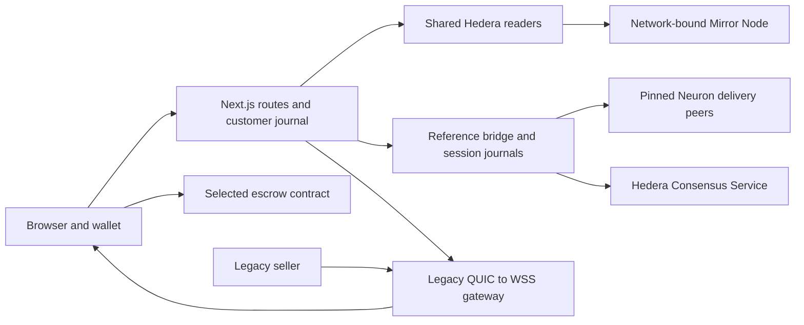

# Architecture

This template provides reusable service discovery, Hedera evidence, wallet authorization and delivery/payment examples. Start with the read-only app; enable a configured integration when its server resources are ready. See [setup](../README.md).

## Package boundaries

| Package                     | Owns                                                                                                              | Entry points                                                                               |
| --------------------------- | ----------------------------------------------------------------------------------------------------------------- | ------------------------------------------------------------------------------------------ |
| `packages/nextjs`           | App Router pages, wallet selection, authenticated APIs and customer SQLite journal                                | `app/`, `app/api/`, `lib/`                                                                 |
| `packages/neuron-hedera`    | Typed network configuration, bounded Mirror/HCS reads, signed-message checks, legacy discovery and Mode-S parsing | `src/index.ts`                                                                             |
| `packages/foundry`          | Starter-specific native-HBAR escrow, contract tests and deployment/reconciliation scripts                         | `src/BuyerEscrow.sol`, `scripts/`                                                          |
| `packages/neuron-go`        | Server-only HCS writes, legacy request creation, persistent QUIC/WSS gateway and reference setup                  | `cmd/`, `legacy/`                                                                          |
| `packages/neuron-reference` | Pinned upstream protocol integration, file delivery and ERC20 settlement coordination                             | `bridge/`, `scripts/prepare.mjs`, [operator guide](../packages/neuron-reference/README.md) |

All JavaScript packages share one `package-lock.json`. The Go gateway has its own module and sums. The reference build prepares an exact upstream checkout outside the repository because upstream Go packages are `internal`; its original bridge overlay and explicit dependency patches are tracked here. Downloaded upstream sources, binaries and runtime journals are not template files.

## Three distinct integrations

| Integration            | Control and data                                                                                                 | Payment boundary                                                                                                                                                                                                   |
| ---------------------- | ---------------------------------------------------------------------------------------------------------------- | ------------------------------------------------------------------------------------------------------------------------------------------------------------------------------------------------------------------ |
| Legacy aviation        | Public legacy directory, Mirror account/topic binding, `neuron/ADSB/0.0.2` QUIC bytes, WSS and Mode-S decoding   | Directory fees and incoming schedule requests are not payable quotes. The gateway never automatically signs seller payments.                                                                                       |
| Native-HBAR extension  | Starter format `neuronCustomerQuote/v1`, seller signature and exact HCS reference                                | `BuyerEscrow` binds buyer, seller, terms, amount and deadline. Funding, delivery approval and refund require explicit buyer authorization. Legacy sellers are not assumed to implement it.                         |
| Reference file service | Draft-008 exchange and original delivery primitives from `neuron-specs@13ab01d70ac42531065094a52cd595ef7b6d3223` | Matching upstream ERC20 escrow, exact allowance/deposit, signed invoice, file hash/length, explicit buyer release and seller withdrawal or deadline refund. This is compatibility with that pinned implementation. |

The reference service transfers a selected real file. Its example is document delivery; the separate aviation adapter carries live sensor bytes. A self-operated seller can exercise the pinned protocol without implying compatibility with every Neuron deployment. The native-HBAR contract and upstream ERC20 escrow have different ABIs and must not be interchanged.

## Identity, state and transaction safety

- One process selects `testnet` or `mainnet`. Shared configuration binds chain ID, official Mirror origin and directory policy. Check account and topic metadata before interpreting messages; an empty message list is insufficient.
- Wallet sign-in uses a one-use challenge, EVM signature, exact origin and selected chain. The session cookie is HttpOnly; customer ownership is checked on server reads and writes. Connecting a wallet does not authorize payment.
- The app stores customer sessions, requests and payment intents in an owner-only SQLite database outside the repository. The legacy gateway maintains a locked append-only connection journal; the reference bridge persists configuration-bound session files.
- Journals retain transaction hashes and prepared nonces across refreshes and restarts. Reconcile uncertain outcomes before another wallet action. Never erase an intent to make a retry possible.
- Browser wallet actions disclose the selected asset, integer amount, recipient, chain and contract. The reference path validates calldata and buffers gas under explicit per-transaction gas/fee limits before opening the wallet.
- Seller signatures, HCS consensus, delivery and executed payment are separate observations. `paid` requires settlement reconciliation; a submitted hash or signed invoice alone cannot set it.
- Server keys, API tokens and databases stay outside the workspace with owner-only permissions. No private key belongs in `NEXT_PUBLIC_*`, API responses or a browser bundle.

The single-host SQLite/file-journal design is deliberate. Horizontal scaling needs shared transactional ownership, replay protection and session routing; adding replicas without those changes is unsupported.

## Extension points

| Change                           | Start here                                                           | Preserve                                                                                            |
| -------------------------------- | -------------------------------------------------------------------- | --------------------------------------------------------------------------------------------------- |
| Frontend branding and navigation | `packages/nextjs/app/layout.tsx`, `page.tsx`, `style.css`            | Visible network and honest capability states                                                        |
| New discovery source             | `packages/neuron-hedera/src/legacy.ts`, `mirror.ts`, `network.ts`    | Explicit provenance, network/identity checks and bounded reads                                      |
| Another binary service           | `packages/neuron-go/legacy/`, `packages/neuron-hedera/src/frames.ts` | Expected peer/protocol, raw bytes, resource limits and freshness                                    |
| Different delivered document     | Reference configuration's service file                               | Snapshot bytes, length and SHA-256; do not mutate active session terms                              |
| New payment protocol             | A separately named shared adapter, server coordinator and wallet UI  | Exact asset units, authenticated terms, explicit authorization, receipt reconciliation and recovery |
| Another browser wallet           | `packages/nextjs/app/wallet/`                                        | Provider choice, account/chain/disconnect events and independent flow verification                  |
| Deployment                       | [testnet deployment guide](../deploy/testnet/README.md)              | Target-architecture native builds, persistent state, HTTPS/WSS and UDP reachability                 |

## Toolchain

The package manifests and lockfiles pin the dependency graph. `.nvmrc` selects the default Node runtime, and CI exercises both supported Node LTS versions. Build native dependencies on the target deployment OS and architecture.

Explicit TypeScript builds use `scripts/tsc.mjs` to select the native compiler. Next.js, ESLint and programmatic transpilation use the supported TypeScript API compatibility package. Keep both roles intact when upgrading. ESLint and Oxlint share authored-source checks; retained Next rules and their license are in `scripts/lint-rules/`, with behavior tests under `scripts/test/`.

Run the [verification commands](verification.md) after changes. Extend tests alongside protocol, state or recovery changes; preserve signed fixture bytes and the separate payment adapters.
