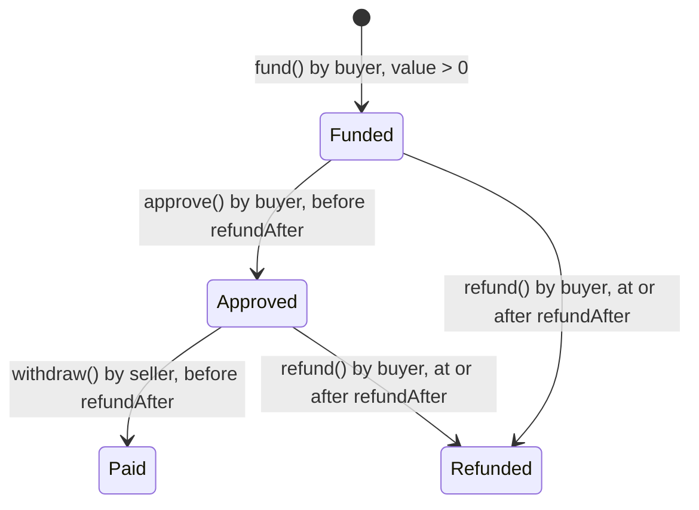

# BuyerEscrow contract

`packages/foundry/src/BuyerEscrow.sol` is a small native-HBAR escrow for one buyer paying one seller against terms the buyer has already reviewed off-chain. It backs the optional `/commerce` flow (`neuronCustomerQuote/v1`). It is separate from the upstream ERC20 `NeuronEscrow` used by the reference adapter; the two ABIs are not interchangeable.

A testnet deployment is at [contract 0.0.10730636](https://testnet.mirrornode.hedera.com/api/v1/contracts/0.0.10730636).

## Lifecycle



| Function | Caller | Rules |
| --- | --- | --- |
| `fund(seller, quoteExpiresAt, refundAfter, termsHash)` | Buyer | `seller` is non-zero and not the buyer; `msg.value > 0`; `termsHash` is non-zero and unused by this buyer; `now ≤ quoteExpiresAt < refundAfter ≤ now + 30 days` |
| `approve(id)` | Buyer | Escrow is `Funded` and the deadline has not passed |
| `withdraw(id)` | Seller | Escrow is `Approved` and the deadline has not passed. Sends the full amount to the seller |
| `refund(id)` | Buyer | Escrow is `Funded` or `Approved` and the deadline has passed. Returns the full amount to the buyer |

Every transition emits an event (`Funded`, `Approved`, `Released`, `Refunded`). State is updated before any value transfer, and each escrow pays out at most once.

## Design decisions

- **Terms are verified off-chain.** `termsHash` is the hash of the seller-signed quote. The app checks the seller signature and the HCS record before it asks the wallet to fund. On-chain, the hash is only a replay guard scoped to the buyer, so a stranger cannot use up someone else's quote. If you need on-chain seller authorization, add an ECDSA check of the seller's signature over `termsHash` in `fund`.
- **`quoteExpiresAt` is checked only when funding.** It stops a buyer from funding a stale quote. After funding, only `refundAfter` matters.
- **Approval is not payment.** If the buyer approves but the seller does not withdraw before `refundAfter`, the buyer can refund. This keeps funds from being stuck with an absent seller. Sellers should withdraw promptly after approval.
- **A seller that rejects HBAR cannot block a refund.** A failed `withdraw` reverts and leaves the escrow `Approved`, so the buyer can still refund at the deadline.
- **No admin, upgrade or fee path.** Nobody other than the buyer and seller of an escrow can move its funds.

## Units

Native HBAR has 8 decimals (tinybars), while JSON-RPC transaction values use 18 decimals. The app and deploy script convert between them explicitly and show the exact amount before the wallet opens. Keep that conversion in one place when you change the flow; see the invariants in [AGENTS.md](../AGENTS.md).

## Tests

`npm run test -w @neuron/foundry` runs:

- **Unit tests** (`test/BuyerEscrow.t.sol`): bounded funding terms, per-buyer replay protection, approval and withdrawal, timeout refund, refunding an approved-but-unclaimed escrow, late approval and a seller that rejects payment.
- **Fuzz tests** (`test/BuyerEscrowFuzz.t.sol`, 1,024 runs each): stored terms match inputs, refund windows over 30 days are rejected, only the buyer can approve and only before the deadline, the seller is paid exactly once, and refunds succeed only at or after the deadline.
- **Invariant tests** (128 runs × 64 calls of random fund/approve/withdraw/refund/time-warp sequences): the contract balance always equals the sum of active escrows, and funded value always equals outstanding plus paid-out value.

## Deploy your own

```sh
HEDERA_NETWORK=testnet \
HEDERA_OPERATOR_ACCOUNT_ID=0.0.YOUR_ACCOUNT \
HEDERA_OPERATOR_KEY_FILE=/absolute/owner-only/key \
HEDERA_MAX_FEE_TINYBAR=100000000 \
HEDERA_CONTRACT_GAS=1000000 \
npm run contract:deploy
```

The signer must be an ECDSA account with an EVM alias. The script checks the account key, the RPC chain ID and the deployed runtime code. See the [native-HBAR setup](configuration.md#native-hbar-extension) for connecting the app to your deployment.
