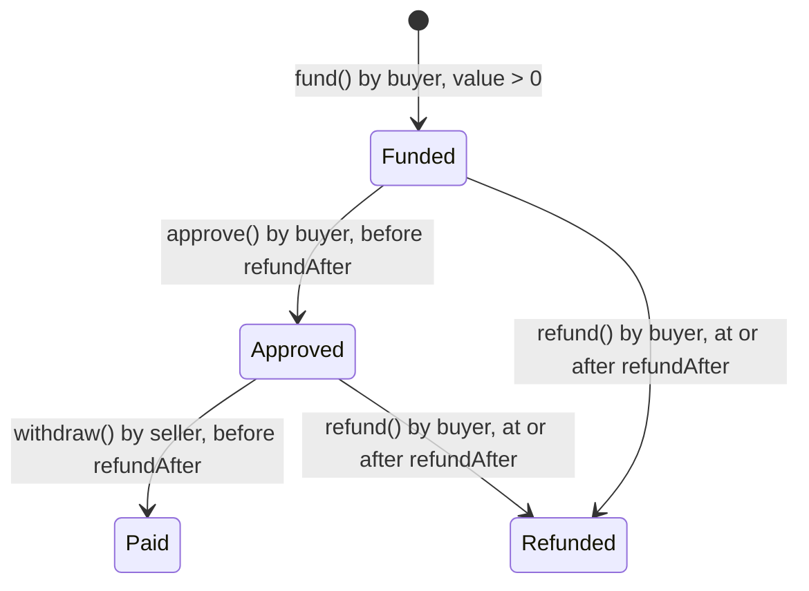

# BuyerEscrow contract

`packages/foundry/src/BuyerEscrow.sol` is a small native-HBAR escrow for one buyer paying one seller against terms the buyer has already reviewed off-chain. It backs the optional `/commerce` flow (`neuronCustomerQuote/v1`). It is separate from the upstream ERC20 `NeuronEscrow` used by the reference adapter; the two ABIs are not interchangeable.

Deploy your own contract and pin its resulting runtime hash in the app configuration. [Historical testnet evidence](testnet-evidence.md) is available separately; those addresses are not deployment defaults.

## Lifecycle



| Function                                               | Caller | Rules                                                                                                                                                           |
| ------------------------------------------------------ | ------ | --------------------------------------------------------------------------------------------------------------------------------------------------------------- |
| `fund(seller, quoteExpiresAt, refundAfter, termsHash)` | Buyer  | `seller` is non-zero and not the buyer; `msg.value > 0`; `termsHash` is non-zero and unused by this buyer; `now ≤ quoteExpiresAt < refundAfter ≤ now + 30 days` |
| `approve(id)`                                          | Buyer  | Escrow is `Funded` and `now < refundAfter`                                                                                                                      |
| `withdraw(id)`                                         | Seller | Escrow is `Approved` and `now < refundAfter`. Sends the full amount to the seller                                                                               |
| `refund(id)`                                           | Buyer  | Escrow is `Funded` or `Approved` and `now ≥ refundAfter`. Returns the full amount to the buyer                                                                  |

Every transition emits an event (`Funded`, `Approved`, `Released`, `Refunded`). State is updated before any value transfer, and each escrow pays out at most once.

## Contract behavior

- **Terms are verified off-chain.** `termsHash` is the hash of the seller-signed quote. The app checks the seller signature and the HCS record before it asks the wallet to fund. On-chain, the hash is only a replay guard scoped to the buyer, so a stranger cannot use up someone else's quote. Changing this trust model requires a new contract and matching quote validation.
- **`quoteExpiresAt` is checked only when funding.** It stops a buyer from funding a stale quote. After funding, only `refundAfter` matters.
- **Approval is not payment.** If the buyer approves but the seller does not withdraw before `refundAfter`, the buyer can refund. This keeps funds from being stuck with an absent seller. Sellers should withdraw promptly after approval.
- **A seller that rejects HBAR cannot block a refund.** A failed `withdraw` reverts and leaves the escrow `Approved`, so the buyer can still refund at the deadline.
- **No admin, upgrade or fee path.** Nobody other than the buyer and seller of an escrow can move its funds.

## Units

Native HBAR has 8 decimals (tinybars), while JSON-RPC transaction values use 18 decimals. Contract storage, native transfer actions and native event amounts are in tinybars. For example, a `100000`-tinybar payment is `0.001 HBAR`, while its JSON-RPC transaction value is `1000000000000000` (18-decimal units). ERC20 `10000000000000000` with 18 decimals is `0.01` tokens, not HBAR. See [current decimal handling](https://docs.hedera.com/evm/differences/hbar-decimals). The app and deploy script convert between native units explicitly and show the exact amount before the wallet opens. Keep that conversion in one place when you change the flow; see the invariants in [AGENTS.md](../AGENTS.md).

## Tests

`npm run test -w @neuron/foundry` runs:

- **Deployment recovery tests** (`test/deployment-journal.test.mjs`): mocked RPC failures, lost broadcast responses, delayed receipts and Mirror indexing, exact transaction replay, configuration changes and consumed nonces, with real private file persistence, process locking and child-process crash recovery. These tests do not send live transactions.
- **Unit tests** (`test/BuyerEscrow.t.sol`): bounded funding terms, per-buyer replay protection, approval and withdrawal, timeout refund, refunding an approved-but-unclaimed escrow, stranger refund rejection at the deadline in both states, late approval, rejected payouts and a recursive seller callback that cannot drain another buyer's escrow.
- **Fuzz tests** (`test/BuyerEscrowFuzz.t.sol`, 1,024 runs each): stored terms match inputs, refund windows over 30 days are rejected, only the buyer can approve and only before the deadline, the seller is paid exactly once, and refunds succeed only at or after the deadline.
- **Invariant tests** (128 runs × 64 calls of random fund/approve/withdraw/refund/time-warp sequences): the contract balance always equals the sum of active escrows, and funded value always equals outstanding plus paid-out value.

## Deploy your own

```sh
HEDERA_NETWORK=testnet \
HEDERA_OPERATOR_ACCOUNT_ID=0.0.YOUR_ACCOUNT \
HEDERA_OPERATOR_KEY_FILE=/absolute/owner-only/key \
HEDERA_DEPLOYMENT_JOURNAL_FILE=/absolute/owner-only/deployment.jsonl \
HEDERA_MAX_FEE_TINYBAR=100000000 \
HEDERA_CONTRACT_GAS=1000000 \
npm run contract:deploy
```

The signer must be an ECDSA account with an EVM Address from Public Key. The script checks the account key, the RPC chain ID and the deployed runtime code. Use a dedicated signer and an owner-only journal outside the checkout. The journal privately persists the exact signed transaction before broadcast; its companion SQLite lock prevents concurrent deployment attempts. If a response is lost, a process exits or Mirror indexing is delayed, rerun with the same configuration and journal to reconcile or resend the identical transaction. Never delete the journal to retry an uncertain deployment. The fee cap is at most 1 HBAR, and this command supports testnet only. See the [native-HBAR setup](configuration.md#native-hbar-extension) for connecting the app to your deployment.

## Seller withdrawal

`native-seller` delivers bytes but never withdraws funds. Only the escrow's seller can call `withdraw(id)` after buyer approval and before `refundAfter`. Use a separate seller wallet or an encrypted Foundry keystore; never put the raw seller key in a command argument, browser variable or shell history. For a local encrypted keystore, `cast wallet import native-seller --interactive` prompts privately for the raw ECDSA key and a password. Check its address with `cast wallet address --account native-seller` against the seller's current Mirror key/EVM address. This does not create an account or send a transaction.

Set these **public** values from your deployment inventory:

```sh
export ETH_RPC_URL=https://testnet.hashio.io/api
export SELLER_ESCROW_ADDRESS=0xYOUR_DEPLOYED_CONTRACT
export SELLER_ESCROW_ID=YOUR_ESCROW_ID
export SELLER_ADDRESS=0xYOUR_SELLER_ADDRESS
```

Before signing, run these read-only checks:

```sh
cast chain-id --rpc-url "$ETH_RPC_URL"
cast call "$SELLER_ESCROW_ADDRESS" 'escrows(uint256)(address,address,uint256,uint64,uint64,bytes32,uint8)' "$SELLER_ESCROW_ID" --rpc-url "$ETH_RPC_URL"
cast nonce "$SELLER_ADDRESS" --block latest --rpc-url "$ETH_RPC_URL"
cast nonce "$SELLER_ADDRESS" --block pending --rpc-url "$ETH_RPC_URL"
cast estimate "$SELLER_ESCROW_ADDRESS" 'withdraw(uint256)' "$SELLER_ESCROW_ID" --from "$SELLER_ADDRESS" --rpc-url "$ETH_RPC_URL"
cast gas-price --rpc-url "$ETH_RPC_URL"
```

Require chain `296`, the independently pinned runtime, exact seller/buyer/amount/terms, state `2` (`Approved`), sufficient seller fee balance and enough time before the deadline. Latest and pending nonce must match; otherwise reconcile the seller's other transaction first. Choose the recorded nonce, a gas limit with headroom above the estimate (at most 400,000), and a legacy gas price at least the quoted network price, with `gasLimit × gasPrice ≤ 500000000000000000` (0.5 HBAR in RPC units). A higher estimate or price requires a new explicit fee review, not an automatic cap increase.

Save the reviewed network, contract/runtime, escrow ID, seller, exact calldata, zero value, nonce and the gas limit and gas price in a new owner-only intent file **before** signing. Reserve the seller wallet for this one operation; the manual command does not provide the application's database lock. Fill `SELLER_NONCE`, `SELLER_GAS_LIMIT` and `SELLER_GAS_PRICE` from that record, then submit once, directing output to fresh private files:

```sh
cast send "$SELLER_ESCROW_ADDRESS" 'withdraw(uint256)' "$SELLER_ESCROW_ID" \
  --account native-seller --chain 296 --legacy --value 0 \
  --nonce "$SELLER_NONCE" --gas-limit "$SELLER_GAS_LIMIT" --gas-price "$SELLER_GAS_PRICE" \
  --rpc-url "$ETH_RPC_URL" --async > /absolute/private/withdraw-hash.txt 2> /absolute/private/withdraw-error.txt
```

The command spends testnet fees and is an explicit seller action. Keep the intent and output even on error. Read the saved hash with `cast receipt HASH --async --rpc-url "$ETH_RPC_URL"`, and inspect official Mirror `/api/v1/contracts/results/HASH` plus `/actions`: require `SUCCESS`, a `Released` event from the pinned contract for the same escrow/seller/amount, the exact positive native transfer to the seller, and final state `3` (`Paid`). The buyer's Commerce refresh should then reconcile the same result. Fees mean the seller's net balance increase need not equal the gross payment.

If no hash is returned, the nonce is consumed, the receipt is missing or the deadline passes, stop and reconcile the recorded seller/nonce with RPC and Mirror history. Do not issue a new-nonce withdrawal to guess what happened, reuse output files, or delete the intent. `cast send` is a manual operator procedure, not a crash-safe automation journal. An unwithdrawn approved escrow remains refundable by the buyer after its deadline.

See [verification](verification.md) for the local checks and [historical testnet evidence](testnet-evidence.md) for read-only receipt verification.
